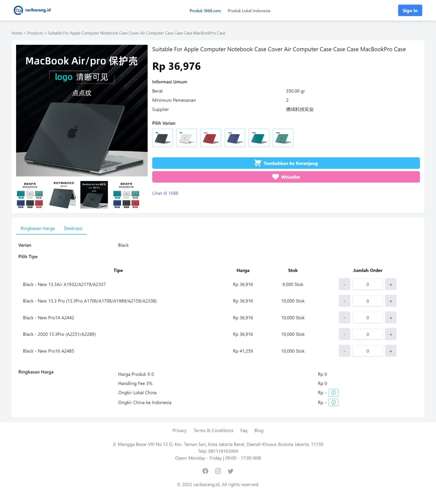
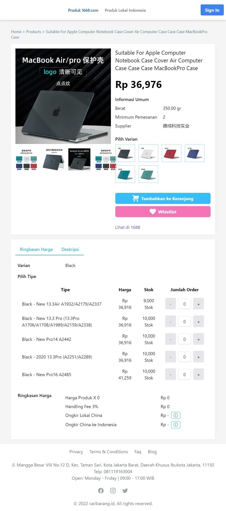
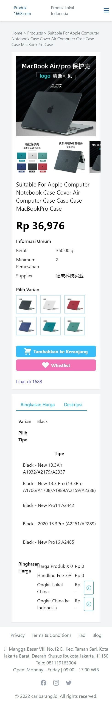

# vue+tailwind-project

Project redesign detail produk caribarang.id

Saya telah membuat redesign dari page detail product caribarang.id, beberapa hal yang belum saya selesaikan yaitu
- Carousel untuk preview Image Product dan Varian Product
- Responsive table ringkasan harga untuk mobile
- Count Produk Dummy yang belum sesuai
  
## Preview Project
Desktop
<div align="center">
  
</div>

Tablet
<div align="center">
  
</div>

Mobile
<div align="center">
  
</div>

## Project Setup

```sh
npm install
```

### Compile and Hot-Reload for Development

```sh
npm run dev
```
